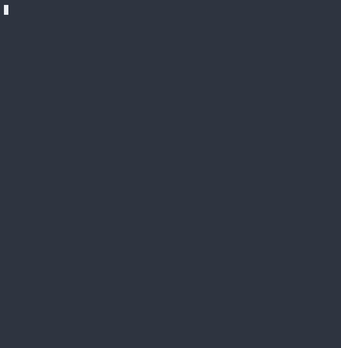

<p>
  
</p>

# RepHack

C# 콘솔 기반 ASCII 로그라이크. NetHack에서 영감을 받아 제작.
원래 NetHack을 만들면서 게임개발에 주로 쓰이는 알고리즘 학습용으로 개발했으나, 갈수록 독자적인 판단으로 만드는 경우가 늘어나 목표가 완성으로 바뀌게 되었음.
대부분은 오버엔지니어링을 자제하였으나, json 방식과 같은 게임개발에 많이 쓰이는 방식의 경우에는 학습을 위해 쓰는 경우가 있음.

<a>
  
</a>

## 핵심 시스템

### 던전 생성

초기에는 랜덤 좌표 배치 + AABB 충돌 검사 방식을 사용했다. 랜덤 위치에 방을 놓고, 기존 방과 겹치면 재시도하는 단순한 구조. 작동은 하지만 방 배치가 한쪽에 몰리거나 시도 횟수 상한(100회)에 걸려 방이 적게 생성되는 문제가 있었다.

이를 해결하기 위해 BSP(Binary Space Partitioning) 방식으로 교체했으며, `Dungeon.ConnectRoom` 메서드로 연결했다. 이유는 두 가지다.

- **공간 활용도 보장** — 분할 자체가 전체 맵을 커버하기 때문에, 방이 한쪽에 몰리거나 빈 공간이 과도하게 생기는 문제가 구조적으로 발생하지 않는다.
- **복도 연결의 자연스러운 구조** — 트리의 형제 노드끼리 복도를 재귀적으로 연결하면, 별도의 연결 알고리즘 없이 모든 방이 도달 가능하다는 것이 보장된다.

또한 모든 리프 노드에 방을 생성한 뒤 `isActive` 플래그로 일부만 활성화하는 방식을 도입했다. null 분기를 구조적으로 제거하면서, 같은 트리에서 서로 다른 맵 구성을 생성할 수 있다.

### 시야 — Recursive Shadowcasting

맵을 팔분원(octant) 8개로 나누고, 각 팔분원마다 거리 단위로 스캔하면서 벽을 만나면 시야 범위를 분할해 재귀 호출하는 방식으로 구현했다. 타일이 점이 아니라 부피를 가진 단위로 판정되도록 `leftSlope`/`rightSlope`에 0.5 오프셋을 적용해, 대각선 경계에서 타일이 간헐적으로 빠지는 문제를 해결했다.

```csharp
// 바닥→벽 전환: 벽 이전까지의 시야 범위로 다음 거리 재귀
if (!wasWall && isWall)
{
    CastLight(distance + 1, currentStartSlope, leftSlope);
}
// 벽→바닥 전환: 시작 기울기를 업데이트하고 현재 줄에서 계속 스캔
else if (wasWall && !isWall)
{
    currentStartSlope = rightSlope;
}
```

탐색 기록은 별도 `explored` 배열로 유지한다. 시야에서 벗어난 영역은 어둡게 표시되지만 맵 구조는 계속 보여, 탐험한 영역의 맥락이 유지된다. NetHack과 동일한 방식이다.

### 적 AI — 다익스트라 경로 탐색

적은 플레이어의 시야 안에 있을 때만 Move를 실행해 최단 경로로 한 칸 이동한다. 시야 판정은 대칭이므로, 플레이어가 볼 수 있는 적은 적도 플레이어를 볼 수 있다는 가정에 기반한다. 이 덕분에 적마다 FOV를 따로 돌리지 않고 한 번의 계산을 공유할 수 있다.

BFS에서 다익스트라로 옮겨간 이유는, 이제 타일마다 cost를 추가하고, 모든 적이 같은 map을 공유함에 따라, 각 enemy마다 BFS를 계산하는 비용을 줄일 수 있기 때문이다.

```csharp
//기존 방식
// 경로 역추적: BFS로 플레이어까지의 경로를 찾은 뒤,
// cameFrom 배열을 따라 시작점까지 역추적하여 "다음 한 칸"을 결정한다.
var lastPos = pos;
while (pos != (enemyX, enemyY))
{
    lastPos = pos;
    pos = cameFrom[lastPos.y, lastPos.x];
}
```

```csharp
//개선 방식
// 다익스트라 알고리즘을 이용해 맵 전체에 플레이어로부터의 거리(distance)를 미리 계산한 뒤 리턴. 적들은 자신의 인접한 타일의 distance만 비교해 가장 낮은 곳으로 이동할 수 있게 됩니다. 역추적 없이 O(1)의 비용으로 다음 단계를 결정한다.
// 또한 적이 점유 중인 타일에 높은 코스트(cost = 10)을 부여하여 적들이 플레이어를 입체적으로 포위할 수 있게 구현함.
foreach(var dir in dirs)
{
    int nx = enemy.X + dir.dx;
    int ny = enemy.Y + dir.dy;

    // 경계 검사 및 장애물 확인
    if (!IsValid(nx, ny) || map[ny, nx].isBlocked) continue;
    
    // 다른 개체가 점유 중인지 확인 (군집 충돌 방지)
    if (isOccupied(nx, ny) != null) continue;

    // 현재 기록된 최소 거리보다 더 낮은(플레이어와 가까운) 타일 선택
    if (map[ny, nx].distance < minValue)
    {
        minValue = map[ny, nx].distance;
        minPos = (nx, ny);
    }
}
IsOccupied를 List → Dictionary 자료구조 변경 후 N=35 기준 IsOccupied 평균 30% 빠름 측정. ToList 매턴 할당으로 GC spike 비율 1% → 2.4% 증가했지만 무시 수준.
```

`Pathfinding` 클래스는 `visited`, `PriorityQueue`를 생성자에서 한 번 할당하고 `Array.Clear`로 재사용한다. 매 턴 배열을 새로 생성하는 GC 부담을 제거하기 위함이다.

### 게임 루프

`Program.Main()`에서 `Start() → Update() → Render()` 순서로 실행되는 표준 게임 루프 패턴을 사용한다.

입력 처리는 `Dictionary<ConsoleKey, Actions>` 키맵을 통해 키 입력을 액션으로 변환하고, `Dictionary<Actions, Action>` 으로 액션을 실행 함수에 바인딩한다. switch문 없이 `TryGetValue → Invoke` 한 줄로 입력-실행이 완료되는 구조다.

```csharp
if (keyMap.TryGetValue(control.GetInput(), out Action? act))
{
    act.Invoke();
}
```

### 렌더링

`Renderer`가 맵 버퍼 생성, 엔티티 오버레이, 색상 적용, 출력을 모두 담당한다. Game은 `renderer.Render(floor)` 한 줄만 호출한다.

시야 시스템과 연동되어, 현재 시야에 있는 타일은 `map` 기준으로 원래 색상으로 그리고, 탐색했지만 시야 밖인 타일은 어둡게 그리며, 미탐색 영역은 공백으로 처리한다. 적과 아이템은 시야 안에서만 보인다.

추가)

(1) 같은 색 연속 구간을 StringBuilder로 묶어 한 번에 출력하는 배치 렌더링을 적용해 Console.Write와 ForegroundColor 변경 호출 수를 대폭 줄였다.

(2) 시야 시스템(isVisible)과 탐색 기록(isExplored)을 분리해 사용하며, 현재 시야 안 타일은 colorMap 기반 원색, 탐색했지만 시야 밖인 타일은 맵 구조를 유지한 채 어둡게, 미탐색 영역은 공백 블록으로 표시한다.

### 클래스 구조

**핵심 시스템**

| 클래스 | 역할 |
|--------|------|
| `Game` | 게임 루프, 시스템 간 조율 |
| `TurnContext` | 한 턴의 공유 상태(player, distanceMap, isOccupied)를 행동에 주입 |
| `Control` | 입력 처리, 키 바인딩 (`Dictionary<Key, Action>`) |
| `Renderer` | 버퍼 기반 렌더링, 시야/탐색 영역 색상 분리, 배치 출력 |

**엔티티**

| 클래스 | 역할 |
|--------|------|
| `Entity` | Player/Enemy 공통 베이스. 좌표·HP·이동·피격·사망 후크 |
| `Player` | 플레이어 상태, 인벤토리 |
| `Enemy` | 적 인스턴스. `IEnemyBehavior` 위임으로 Act 처리 |
| `Item` | 아이템. `IItemEffect` 위임으로 Use 처리 |
| `EnemyRegistry` | 위치 `Dictionary` 관리. `Enemy.Moved` 이벤트 구독으로 O(1) 조회 |

**맵 · 시야 · 길찾기**

| 클래스 | 역할 |
|--------|------|
| `Dungeon` | BSP 기반 절차적 맵 생성, 형제 노드 재귀 복도 연결 |
| `FOV` | Recursive Shadowcasting, `isVisible`/`isExplored` 분리 |
| `Pathfinding` | Dijkstra Map (전체 적이 공유). 배열·PriorityQueue 재사용으로 GC 최소화 |

**적 행동 전략** (`Scripts/Behaviors/`, Strategy 패턴)

| 클래스 | 역할 |
|--------|------|
| `IEnemyBehavior` | 적 행동 인터페이스 |
| `IRangedEnemy` | 원거리 능력 확장. 위험 라인(`AttackLine`) 노출 |
| `ChaseBehavior` | 다익스트라 맵 따라 1칸 추격 |
| `RandomChaseBehavior` | 약 50% 추격 / 50% 랜덤 이동 |
| `ChaseCloseBuffBehavior` | 거리 가까울수록 데미지 증가 |
| `DrainOnHitChaseBehavior` | 명중 시 자가 회복 |
| `WarnRangedBehavior` | 시야 진입 1턴 경고 → 다음 턴 사격 |
| `InstantRangedBehavior` | 시야 진입 시 25% 확률 즉시 사격 |

**아이템 효과** (`Scripts/Effects/`, Strategy 패턴)

| 클래스 | 역할 |
|--------|------|
| `IItemEffect` | 아이템 효과 인터페이스 |
| `HealEffect` | HP 회복 |
| `BaseEffect` | 효과 없는 기본 (예: Water) |

**데이터 드리븐 인프라** (`Scripts/Loaders/`, `Data/*.json`)

| 클래스 | 역할 |
|--------|------|
| `EnemyData` / `ItemData` | JSON 직렬화용 POCO |
| `EnemyLoader` / `ItemLoader` | startup 시 JSON → 데이터 리스트 deserialize |
| `EnemyFactory` / `ItemFactory` | 데이터 + 행동/효과 키 매핑으로 인스턴스 생성, 미등록 키 폴백 |

## 구현 완료

- BSP 기반 절차적 던전 생성 (트리 기반 복도 연결)
- Recursive Shadowcasting 시야 시스템 (탐색 기록 포함)
- FOV 연동 BFS 적 AI
- `Entity` 상속 계층 (Player, Enemy 공통화)
- 층 전환 시스템
- 아이템 습득 및 사용 (다형성 기반 Use 메서드)
- 인벤토리 시스템
- 버퍼 기반 렌더링 + 색상
- 게임오버 처리
- Dijkstra Map
- 적 행동 다양화

## 향후 계획

- **장비 시스템** — 무기/방어구 장착, 스탯 반영
- **스크롤/포션 효과 다양화** — 미확인 아이템 식별 스템 (NetHack의 핵심 시스템)

## 조작

| 키 | 동작 |
|----|------|
| `↑↓←→` | 이동 / 인접한 적 공격 |
| `,` | 아이템 줍기 |
| `I` | 인벤토리 열기 |
| `a~z` | 포션 사용 |

## 빌드

```bash
dotnet run --project RepHack
```

.NET 8.0 이상 필요.